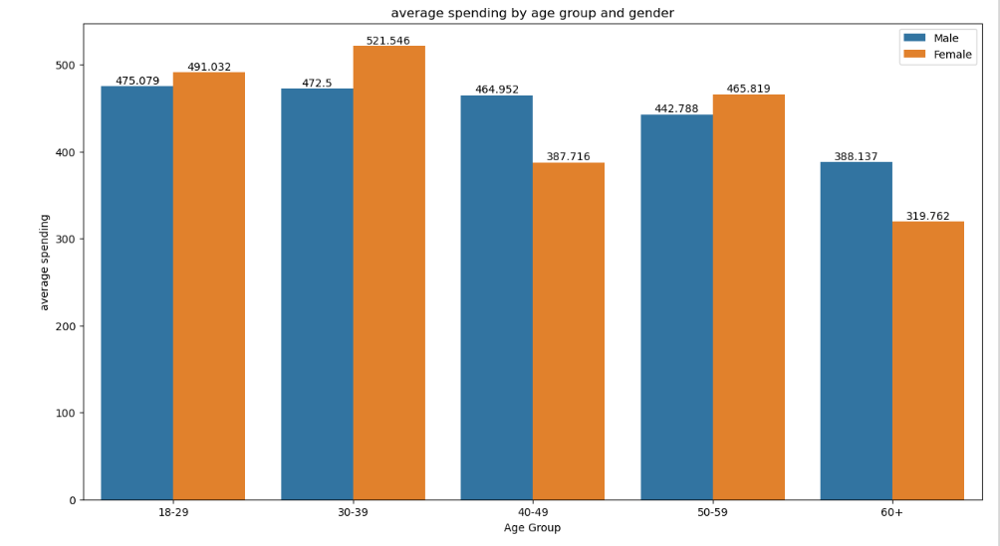
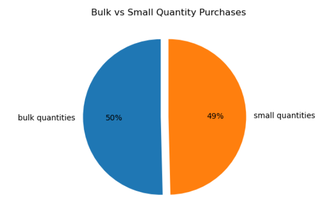
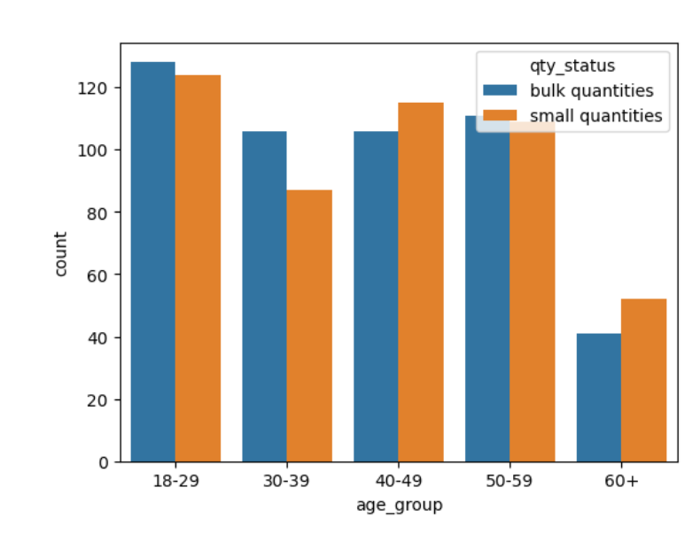
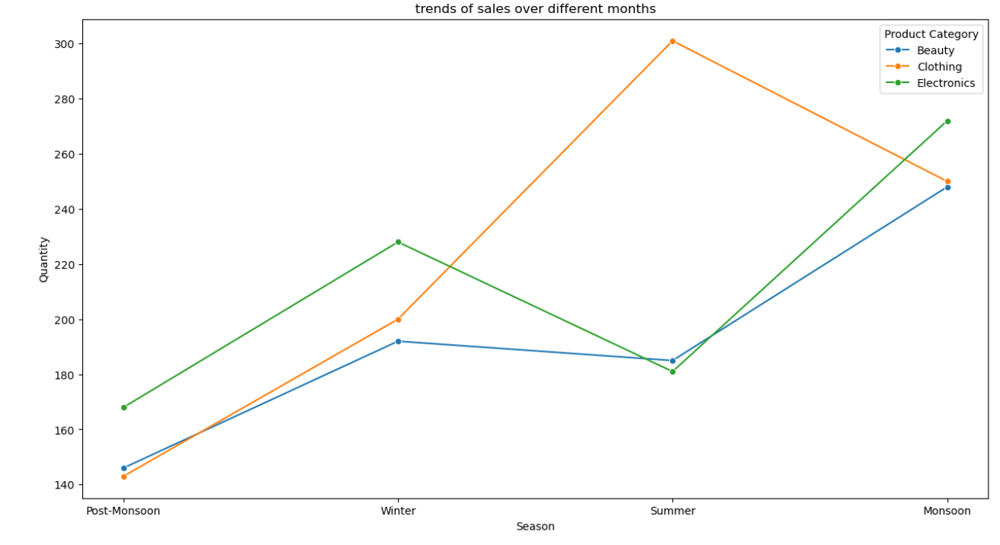
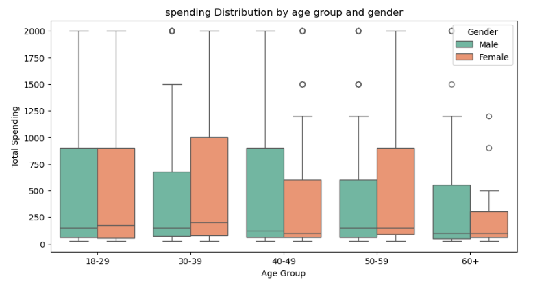

# Retail Sales Data Analysis (EDA) 🛒📊

## 📌 Project Objective
This project performs **Exploratory Data Analysis (EDA)** on retail sales data using Python and data analysis libraries. The objective is to analyze customer behavior, sales trends, and purchasing patterns to derive meaningful business insights.

---

## 🛠 Skills / Tools
- Python  
- Pandas  
- NumPy  
- Matplotlib  
- Seaborn  

---

## 📂 Dataset
-[Download Here](https://drive.google.com/drive/u/0/folders/1G3K4uiuEtdFxqzPg5r83zLEHwE1yUZYo)

---

## 🖼 Images / Plots

### 1️⃣ Average Spending by Age Group and Gender

**Insights:**
- Highest spending is observed in the **30–39 age group**, indicating this segment as the most valuable.  
- Female customers dominate spending in younger age groups.  
- Spending decreases significantly in the **60+ age group**, suggesting conservative buying behavior.

---

### 2️⃣ Bulk vs Small Quantity Purchases

**Insights:**
- Bulk and small quantity purchases are almost evenly split, showing balanced customer buying behavior.  
- Slight dominance of bulk purchases indicates preference for stock-up buying.  
- Both bulk discounts and small-quantity convenience strategies are effective.

---

### 3️⃣ Quantity Purchase Pattern by Age Group

**Insights:**
- Younger age groups prefer **bulk purchases**, indicating higher consumption needs.  
- Middle-aged customers show a balanced mix of bulk and small purchases.  
- Older customers (60+) prefer small quantity purchases.

---

### 4️⃣ Seasonal Sales Trend by Product Category

**Insights:**
- Clothing sales peak during the **summer season** due to seasonal demand.  
- Electronics perform strongly during **winter and monsoon seasons**.  
- Beauty products show consistent demand across all seasons.

---

### 5️⃣ Spending Distribution by Age Group and Gender

**Insights:**
- High spending variability is seen in the **30–39 and 40–49 age groups**.  
- Female customers show higher median spending in certain age groups.  
- Spending becomes lower and more consistent in the **60+ group**.

---

## 📋 What it Does
- Cleans and analyzes retail sales data  
- Visualizes customer spending and purchasing patterns  
- Identifies trends across age groups, gender, and seasons  

---

## 🏗 Steps / Approach
1. **Data Cleaning** – Handle missing values and prepare data  
2. **EDA** – Analyze spending, quantity, and seasonal trends  
3. **Data Visualization** – Create charts to represent insights  
4. **Insights** – Summarize key findings  

---

## 🗓 Submission Date
08-01-2026  

---

## 🎯 Career Relevance
- Demonstrates strong skills in **Python, EDA, and data visualization**  
- Highlights ability to analyze customer behavior and sales trends  
- Suitable for **Data Analyst internships and entry-level roles**
